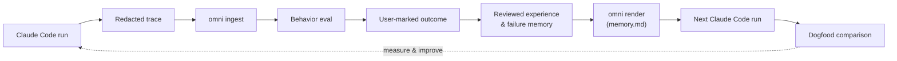

<div align="center">

# 🧠 OmniMemory

**A local, CLI-only memory loop that makes Claude Code learn from its own runs.**

The first milestone of the [OmniAgent](https://github.com/Jerry2003826/OmniAgent) project.

[](https://github.com/Jerry2003826/OmniAgent/actions/workflows/ci.yml)


**English** · [简体中文](README.zh-CN.md)

</div>

---

Claude Code starts every session from zero. It re-scans your repo, re-discovers
which test command to run, and re-learns the same lessons it learned yesterday.
**OmniMemory closes that loop.** It captures what Claude Code actually did,
turns it into reviewable memory, and feeds it back into the next run — so the
next session starts where the last one ended.

No service. No cloud. No vector database. No LLM calls. Everything is
project-local under `.omni/`, and **every byte is redacted before it is written
to disk.**

## 🔁 How it works



A run is captured as a redacted trace, ingested into a local SQLite store,
evaluated for behavior, and anchored with a user-marked outcome. Deterministic
facts become **experience** and **failure** candidates that *you* approve before
they ever reach memory. Approved memory is rendered into a `memory.md` block that
Claude Code reads on the next run — and a cold/warm comparison measures whether
behavior actually improved.

## ✨ Principles

- **🔒 Local-first** — all state lives in the project's `.omni/` directory. No background service, no network, no telemetry.
- **🧼 Redaction-before-write** — every content byte written under `.omni/` passes through the redactor first. There is no raw-dump path and no original vault; redaction is irreversible.
- **👤 Human-reviewed** — facts become *candidates*. Nothing enters memory until you explicitly approve it. There is no automatic success inference and no automatic memory evolution.
- **↩️ Retractable** — rendered guidance can be retired. A bad experience note or failure pattern stops appearing in `memory.md` once you retire it.
- **📏 Measurable** — `omni eval` and `omni eval dogfood` quantify whether memory changed the next run's behavior, instead of assuming it did.

## 🚀 Quickstart

Requires **Python 3.11+**. Zero runtime dependencies — the tool is pure standard
library; `pytest` is the only dev dependency.

```powershell
# From this checkout
pip install -e ".[dev]"
omni --help
pytest -q
omni audit secrets
```

> ⚠️ Never install Claude Code hooks into a real project until `omni audit secrets`
> exits `0` in **both** this checkout and the target project.

## 📖 Usage

### 1. Wire up a Claude Code project

```powershell
omni init                              # create the .omni/ layout
omni audit secrets                     # safety gate (must pass first)
omni init --install-claude-hooks --yes # install capture hooks
omni inject claude --mode preview      # preview the CLAUDE.md change
omni inject claude --mode link         # link memory.md into CLAUDE.md
```

`omni inject claude --mode link` only ever touches this managed region of
`CLAUDE.md` — your own content is never modified:

```md
<!-- omni:begin -->
@.omni/generated/memory.md
<!-- omni:end -->
```

### 2. After a Claude Code run

```powershell
omni ingest                            # import redacted traces -> note the run_id
omni audit secrets
omni status
omni eval run <run_id>                 # how did this run behave?
omni verify                            # read-only: run the known test command
omni outcome mark-from-verify <run_id> --success --task-type validation
```

> Read the new `run_id` from the `run_ids=...` line printed by `omni ingest`
> (not from `omni status`). Pass `--success` **only** after a passing
> verification command and once you have confirmed the task actually succeeded;
> otherwise use `--failed` or `--unknown`.

### 3. Curate, render, and compare

```powershell
omni experience extract <run_id>       # propose experience candidates
omni experience ls
omni experience approve <exp_cand_id>  # nothing renders until approved

omni failure extract <run_id>          # propose failure candidates
omni failure approve <id> --summary "..." --suggested-action "..."

omni render --diff                     # preview the memory.md change
omni render                            # write .omni/generated/memory.md

omni eval dogfood --cold <old_run_id> --warm <new_run_id>
```

Made a mistake? Retire the rendered guidance and re-render:

```powershell
omni experience note retire <note_id>
omni failure pattern retire <pattern_id>
omni render
```

## 🧰 Command reference

`R` = read-only (opens SQLite read-only, runs no migrations) · `W` = writes SQLite.

| Stage | Command | | What it does |
|---|---|:--:|---|
| **Setup** | `omni init [--install-claude-hooks] [--yes]` | — | Create `.omni/`; optionally install Claude Code hooks |
| | `omni audit secrets` | R | Safety gate — scans the whole `.omni/` tree for leaks |
| | `omni inject claude --mode preview\|link` | — | Manage the `CLAUDE.md` managed region |
| **Capture** | `omni hook` *(auto-invoked)* | — | Redacts hook input and appends to the spool; always exits `0` |
| | `omni ingest` | W | Import redacted traces into the local store |
| | `omni status` | R | Project health: link, database, generated memory |
| **Evaluate** | `omni eval run <run_id>` | R | Heuristic behavior eval for one run |
| | `omni eval dogfood --cold <id> --warm <id>` | R | Cold/warm behavior comparison |
| | `omni verify [--qualifier <q>]` | R\* | Run the known verification command (read-only to OmniMemory state) |
| **Outcome** | `omni outcome mark-from-verify <run_id> ...` | W | Bridge a `verify` result into the outcome log |
| | `omni outcome mark <run_id> ...` | W | Manually record an outcome |
| | `omni outcome show <run_id>` | R | Show a recorded outcome |
| **Experience** | `omni experience extract\|ls\|show` | R/W | Propose and inspect experience candidates |
| | `omni experience approve\|reject <id>` | W | Approve a candidate into an active note (or reject it) |
| | `omni experience note ls\|show\|retire` | R/W | Manage rendered experience notes |
| **Failure** | `omni failure extract\|ls\|show` | R/W | Propose and inspect failure candidates |
| | `omni failure approve\|reject <id>` | W | Approve a candidate into a known-failure pattern |
| | `omni failure pattern ls\|show\|retire` | R/W | Manage rendered failure patterns |
| **Render** | `omni render [--diff]` | W | Render `.omni/generated/memory.md` |

\* `omni verify` writes no OmniMemory state, but it *does* execute your project's
verification command (e.g. `pnpm run test`).

## 📊 Results

Real dogfood evidence from a live Claude Code project
([full closeout](docs/cli-only-claude-code-v1-closeout-2026-06-15.md)). With
memory in place, Claude Code went straight to the right test command instead of
re-scanning the repo:

| Metric | ❄️ Cold run | 🔥 Warm run |
|---|:--:|:--:|
| Rediscovery events before the test command | **10** | **0** |
| First expected command | — | `pnpm run test` |
| Verification executed before rediscovery | no | **yes** |
| `memory_effect` | `failed_to_help` | `neutral`* |

➡️ `command_adopted = true`, `improvement = true`.

\* The single-run `memory_effect` stays `neutral` because Claude Code does not
emit a detectable `Read` event for `CLAUDE.md`/`memory.md`; the **cold/warm
comparison is the stronger signal** that behavior actually changed.

## 🎯 Scope

This release is deliberately narrow. It is the smallest thing that proves the
loop works end to end for one local Claude Code user.

| ✅ In v1 | 🚫 Not in v1 |
|---|---|
| Project-local `.omni/` state | MCP server / background service |
| Claude Code hook capture | Vector / embedding search |
| `omni audit secrets` safety gate | Dashboard / TUI |
| Ingest, behavior eval, dogfood comparison | Multi-agent / multi-engine adapters |
| User-marked outcomes | LLM extractors |
| Reviewable experience & failure memory | Automatic success / failure inference |
| Retirable rendered guidance | Automatic memory evolution |
| Read-only `omni verify` preflight | Supersede / reactivation lifecycle |
| Deterministic `memory.md` rendering | New DB tables beyond migrations `001`–`006` |

See [`AGENTS.md`](AGENTS.md) for the authoritative governance and non-goals.

## 🏗️ Architecture

State is a small SQLite database plus a redacted spool, all under `.omni/`.
Hooks only ever append redacted lines to the spool — they never touch the
database. The rendered `memory.md` is organized as:

```text
Fast Path  ·  Commands  ·  Experience Notes  ·  Known Failures  ·  Boundaries  ·  Project
```

Core modules live in [`src/omni/`](src/omni/):

| Module | Responsibility |
|---|---|
| `cli.py` | Command routing (argparse) |
| `redact.py` | Redaction core — fail-closed, irreversible |
| `hook.py` / `spool.py` | Capture hook input → redacted spool |
| `parse.py` / `ingest.py` / `store.py` | Parse transcripts, ingest, content-addressed storage |
| `db.py` | SQLite connection & migrations (`migrations/001`–`006`) |
| `audit.py` | `omni audit secrets` safety gate |
| `extract/` | Deterministic fact extraction (package manager, scripts, observed) |
| `gate.py` / `review.py` | Fact review gating |
| `eval.py` | Behavior eval & dogfood comparison |
| `outcome.py` | User-marked outcome log |
| `experience.py` / `failure.py` | Candidate → reviewed memory lifecycle |
| `verify.py` | Read-only verification preflight |
| `render.py` / `inject.py` | Render `memory.md` & inject the `CLAUDE.md` region |

## 🛡️ Safety invariants

These are hard rules — a violation is grounds for reverting the change:

1. Every content byte written under `.omni/` is redacted first. There is no raw-dump path and no original vault.
2. `omni hook` **always** exits `0`. It never blocks Claude Code and makes no permission decisions.
3. Hooks never write the database; only the designated write commands do.
4. Read-only commands open SQLite read-only and never run migrations.
5. `CLAUDE.md` is only modified inside the `<!-- omni:begin -->` … `<!-- omni:end -->` region.
6. Real projects are off-limits until `omni audit secrets` exits `0`.

## 📚 Documentation

- [`AGENTS.md`](AGENTS.md) — project governance, safety rules, and non-goals (read this first)
- [`docs/cli-only-claude-code-v1-runbook.md`](docs/cli-only-claude-code-v1-runbook.md) — full operator path
- [`docs/cli-only-claude-code-v1-release-notes.md`](docs/cli-only-claude-code-v1-release-notes.md) — what shipped
- [`docs/cli-only-claude-code-v1-closeout-2026-06-15.md`](docs/cli-only-claude-code-v1-closeout-2026-06-15.md) — dogfood evidence
- [`docs/experience-memory-v0.md`](docs/experience-memory-v0.md) · [`docs/failure-memory-v0.md`](docs/failure-memory-v0.md) — memory model

## 🧑‍💻 Development

```powershell
pip install -e ".[dev]"
pytest -q                 # run the test suite
git diff --check          # no whitespace errors
python -m omni.cli audit secrets   # when .omni/ or output changed
```

CI runs the suite on Python 3.11 and 3.12 for every push and pull request.

## 📄 License

No license file is currently included; treat the project as all-rights-reserved
until one is added.
