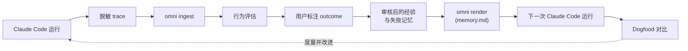

<div align="center">

# 🧠 OmniMemory

**一个本地、纯 CLI 的记忆闭环，让 Claude Code 从自己的运行中学习。**

[OmniAgent](https://github.com/Jerry2003826/OmniAgent) 项目的第一个里程碑。

[](https://github.com/Jerry2003826/OmniAgent/actions/workflows/ci.yml)


[English](README.md) · **简体中文**

</div>

---

Claude Code 每次都是从零开始：重新扫描仓库、重新摸索该跑哪个测试命令、把昨天
学过的东西再学一遍。**OmniMemory 把这个循环闭合起来。** 它捕获 Claude Code
实际做了什么，转化成可审核的记忆，再喂回下一次运行——让下一次会话从上一次结束
的地方继续。

没有后台服务、没有云、没有向量数据库、没有 LLM 调用。所有状态都在项目本地的
`.omni/` 目录下，并且**写入磁盘前每一个字节都会先脱敏。**

## 🔁 工作原理



一次运行被捕获为脱敏 trace，导入本地 SQLite 存储，做行为评估，并用用户标注的
outcome 锚定。确定性 facts 会变成**经验（experience）**和**失败（failure）**
候选——只有经过*你*的批准，才会进入记忆。批准后的记忆被渲染进一个 `memory.md`
区块，供 Claude Code 在下一次运行时读取；随后一次冷/暖（cold/warm）对比会度量
行为是否真的改善了。

## ✨ 设计原则

- **🔒 本地优先** —— 所有状态都在项目的 `.omni/` 目录。没有后台服务，不联网，无遥测。
- **🧼 写入前脱敏** —— 写入 `.omni/` 的每一个内容字节都先经过脱敏器。没有任何原始转储路径，也没有原始保险库；脱敏不可逆。
- **👤 人工审核** —— facts 先成为*候选*。在你显式批准之前，任何东西都不会进入记忆。没有自动成功推断，也没有自动记忆演化。
- **↩️ 可撤回** —— 已渲染的 guidance 可以被 retire。一条糟糕的经验笔记或失败模式，一旦 retire 就不再出现在 `memory.md` 中。
- **📏 可度量** —— `omni eval` 和 `omni eval dogfood` 会量化记忆是否改变了下一次运行的行为，而不是想当然地假设它有效。

## 🚀 快速开始

需要 **Python 3.11+**。零运行时依赖——本工具纯标准库实现；`pytest` 是唯一的开发依赖。

```powershell
# 在本仓库 checkout 内
pip install -e ".[dev]"
omni --help
pytest -q
omni audit secrets
```

> ⚠️ 在 `omni audit secrets` 于**本 checkout 和目标项目中都**退出码为 `0` 之前,
> 切勿把 Claude Code hooks 安装进真实项目。

## 📖 使用

### 1. 接入一个 Claude Code 项目

```powershell
omni init                              # 创建 .omni/ 布局
omni audit secrets                     # 安全门禁（必须先通过）
omni init --install-claude-hooks --yes # 安装捕获 hooks
omni inject claude --mode preview      # 预览 CLAUDE.md 改动
omni inject claude --mode link         # 把 memory.md 链接进 CLAUDE.md
```

`omni inject claude --mode link` 只会改动 `CLAUDE.md` 中下面这个 managed 区块，
你自己的内容永远不会被修改：

```md
<!-- omni:begin -->
@.omni/generated/memory.md
<!-- omni:end -->
```

### 2. 一次 Claude Code 运行之后

```powershell
omni ingest                            # 导入脱敏 trace —— 记下 run_id
omni audit secrets
omni status
omni eval run <run_id>                 # 这次运行的行为如何？
omni verify                            # 只读：运行已知的测试命令
omni outcome mark-from-verify <run_id> --success --task-type validation
```

> 从 `omni ingest` 打印的 `run_ids=...` 这一行读取新的 `run_id`（不要从
> `omni status` 取）。只有在验证命令通过、且你已确认任务确实成功之后，才加
> `--success`；否则用 `--failed` 或 `--unknown`。

### 3. 审核、渲染与对比

```powershell
omni experience extract <run_id>       # 生成经验候选
omni experience ls
omni experience approve <exp_cand_id>  # 未批准前不会渲染任何内容

omni failure extract <run_id>          # 生成失败候选
omni failure approve <id> --summary "..." --suggested-action "..."

omni render --diff                     # 预览 memory.md 改动
omni render                            # 写入 .omni/generated/memory.md

omni eval dogfood --cold <old_run_id> --warm <new_run_id>
```

写错了？把已渲染的 guidance retire 掉，再重新渲染：

```powershell
omni experience note retire <note_id>
omni failure pattern retire <pattern_id>
omni render
```

## 🧰 命令参考

`R` = 只读（以只读方式打开 SQLite，不跑任何迁移） · `W` = 写 SQLite。

| 阶段 | 命令 | | 作用 |
|---|---|:--:|---|
| **接入** | `omni init [--install-claude-hooks] [--yes]` | — | 创建 `.omni/`；可选安装 Claude Code hooks |
| | `omni audit secrets` | R | 安全门禁——扫描整个 `.omni/` 树是否有泄露 |
| | `omni inject claude --mode preview\|link` | — | 管理 `CLAUDE.md` 的 managed 区块 |
| **捕获** | `omni hook` *(自动调用)* | — | 脱敏 hook 输入并追加到 spool；永远退出 `0` |
| | `omni ingest` | W | 把脱敏 trace 导入本地存储 |
| | `omni status` | R | 项目健康度：link、database、generated memory |
| **评估** | `omni eval run <run_id>` | R | 对单次运行做启发式行为评估 |
| | `omni eval dogfood --cold <id> --warm <id>` | R | 冷/暖行为对比 |
| | `omni verify [--qualifier <q>]` | R\* | 运行已知验证命令（对 OmniMemory 状态只读） |
| **Outcome** | `omni outcome mark-from-verify <run_id> ...` | W | 把 `verify` 结果桥接进 outcome log |
| | `omni outcome mark <run_id> ...` | W | 手动记录一条 outcome |
| | `omni outcome show <run_id>` | R | 查看已记录的 outcome |
| **经验** | `omni experience extract\|ls\|show` | R/W | 生成并查看经验候选 |
| | `omni experience approve\|reject <id>` | W | 把候选批准为 active note（或拒绝） |
| | `omni experience note ls\|show\|retire` | R/W | 管理已渲染的经验笔记 |
| **失败** | `omni failure extract\|ls\|show` | R/W | 生成并查看失败候选 |
| | `omni failure approve\|reject <id>` | W | 把候选批准为 known-failure 模式 |
| | `omni failure pattern ls\|show\|retire` | R/W | 管理已渲染的失败模式 |
| **渲染** | `omni render [--diff]` | W | 渲染 `.omni/generated/memory.md` |

\* `omni verify` 不写任何 OmniMemory 状态，但它*确实会*执行你项目的验证命令
（例如 `pnpm run test`）。

## 📊 实测结果

来自一个真实 Claude Code 项目的 dogfood 证据（[完整 closeout](docs/cli-only-claude-code-v1-closeout-2026-06-15.md)）。
有了记忆之后，Claude Code 直接用上了正确的测试命令，而不是重新扫描仓库：

| 指标 | ❄️ 冷运行 | 🔥 暖运行 |
|---|:--:|:--:|
| 测试命令前的 rediscovery 次数 | **10** | **0** |
| 首个 expected command | — | `pnpm run test` |
| 在 rediscovery 之前执行了验证 | 否 | **是** |
| `memory_effect` | `failed_to_help` | `neutral`* |

➡️ `command_adopted = true`，`improvement = true`。

\* 单次运行的 `memory_effect` 之所以是 `neutral`，是因为 Claude Code 没有对
`CLAUDE.md`/`memory.md` 发出可检测的 `Read` 事件；**冷/暖对比才是行为确实改变了
的更强信号。**

## 🎯 范围

本版本刻意保持窄。它是能端到端证明这个闭环、对单个本地 Claude Code 用户有效的
最小集合。

| ✅ v1 包含 | 🚫 v1 不包含 |
|---|---|
| 项目本地 `.omni/` 状态 | MCP server / 后台服务 |
| Claude Code hook 捕获 | 向量 / embedding 检索 |
| `omni audit secrets` 安全门禁 | Dashboard / TUI |
| ingest、行为评估、dogfood 对比 | 多 agent / 多引擎 adapter |
| 用户标注 outcome | LLM extractor |
| 可审核的经验与失败记忆 | 自动成功 / 失败推断 |
| 可 retire 的已渲染 guidance | 自动记忆演化 |
| 只读的 `omni verify` 预检 | supersede / reactivation 生命周期 |
| 确定性的 `memory.md` 渲染 | 迁移 `001`–`006` 之外的新 DB 表 |

权威治理与 non-goals 详见 [`AGENTS.md`](AGENTS.md)。

## 🏗️ 架构

状态由一个小型 SQLite 数据库加一个脱敏 spool 组成，全部位于 `.omni/` 下。Hooks
只会向 spool 追加脱敏后的行——它们绝不触碰数据库。渲染出的 `memory.md` 结构如下：

```text
Fast Path  ·  Commands  ·  Experience Notes  ·  Known Failures  ·  Boundaries  ·  Project
```

核心模块位于 [`src/omni/`](src/omni/)：

| 模块 | 职责 |
|---|---|
| `cli.py` | 命令路由（argparse） |
| `redact.py` | 脱敏核心——fail-closed、不可逆 |
| `hook.py` / `spool.py` | 捕获 hook 输入 → 脱敏 spool |
| `parse.py` / `ingest.py` / `store.py` | 解析 transcript、ingest、内容寻址存储 |
| `db.py` | SQLite 连接与迁移（`migrations/001`–`006`） |
| `audit.py` | `omni audit secrets` 安全门禁 |
| `extract/` | 确定性 fact 提取（包管理器、scripts、observed） |
| `gate.py` / `review.py` | fact 审核门禁 |
| `eval.py` | 行为评估与 dogfood 对比 |
| `outcome.py` | 用户标注的 outcome log |
| `experience.py` / `failure.py` | 候选 → 审核记忆的生命周期 |
| `verify.py` | 只读验证预检 |
| `render.py` / `inject.py` | 渲染 `memory.md` 并注入 `CLAUDE.md` 区块 |

## 🛡️ 安全不变量

这些是硬规则——违反就应回退（revert）该改动：

1. 写入 `.omni/` 的每一个内容字节都先脱敏。没有原始转储路径，也没有原始保险库。
2. `omni hook` **永远**退出 `0`。它从不阻塞 Claude Code，也不做权限判断。
3. Hooks 从不写数据库；只有指定的写命令才写。
4. 只读命令以只读方式打开 SQLite，从不运行迁移。
5. `CLAUDE.md` 只在 `<!-- omni:begin -->` … `<!-- omni:end -->` 区块内被修改。
6. 在 `omni audit secrets` 退出码为 `0` 之前，真实项目一律禁止接入。

## 📚 文档

- [`AGENTS.md`](AGENTS.md) —— 项目治理、安全规则与 non-goals（请先读这个）
- [`docs/cli-only-claude-code-v1-runbook.md`](docs/cli-only-claude-code-v1-runbook.md) —— 完整操作路径
- [`docs/cli-only-claude-code-v1-release-notes.md`](docs/cli-only-claude-code-v1-release-notes.md) —— 本次交付内容
- [`docs/cli-only-claude-code-v1-closeout-2026-06-15.md`](docs/cli-only-claude-code-v1-closeout-2026-06-15.md) —— dogfood 证据
- [`docs/experience-memory-v0.md`](docs/experience-memory-v0.md) · [`docs/failure-memory-v0.md`](docs/failure-memory-v0.md) —— 记忆模型

## 🧑‍💻 开发

```powershell
pip install -e ".[dev]"
pytest -q                 # 运行测试套件
git diff --check          # 无空白错误
python -m omni.cli audit secrets   # 当 .omni/ 或输出有改动时
```

CI 会在每次 push 和 pull request 时，于 Python 3.11 和 3.12 上运行测试套件。

## 📄 许可证

本项目采用 **MIT OR Apache-2.0** 双许可，您可任选其一。详见 [LICENSE](LICENSE)、
[LICENSE-MIT](LICENSE-MIT) 与 [LICENSE-APACHE](LICENSE-APACHE)。
